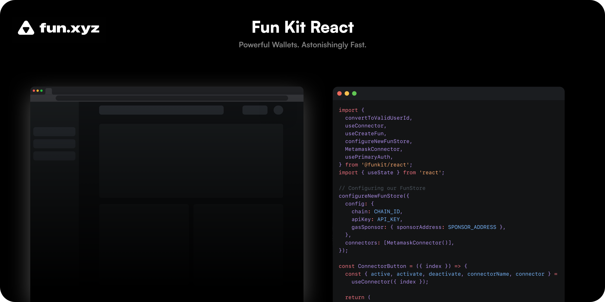

# **FunKit React**

FunKit empowers you to create feature-rich and extensible smart wallets built on account abstraction. Leveraging FunKit, you can customize gas behavior, implement multi-sig and other authentication schemes, monetize your application, execute any transactions from smart wallets, and much more.

Our React SDK offers a highly abstracted and streamlined developer experience for creating and interacting with Fun wallets using React hooks. Check out the [FunKit Core SDK](https://github.com/fun-xyz/funkit-core) if you want to use Fun wallets outside React, or need to access lower level APIs.

## **Table of Contents**

1. **[Installation](#installation)**
2. **[Quick Start](#quickstart)**
3. **[Testing](#testing)**
4. **[More Resources](#moreresources)**

## <a id="installation"></a> **Installation**

```shell
npm i @funkit/react --save
# or
yarn add @funkit/react
```

## <a id="quickstart"></a> **Quick Start**

The FunKit React SDK needs to be configured with an API key. Get an API key by signing up or logging in to the [FunKit Dashboard](https://app.fun.xyz/onboarding).

### 1. Import

Import everything we need to start using Fun wallets.

```js
"use client"; // All React hooks need to be used in a client context
import {
  FunContextProvider,
  Goerli,
  useMetamaskAuth,
  useFunWallet,
} from "@funkit/react";
```

### 2. SDK Configuration

The following parameters are used to configure the behavior of the SDK in your app:

1. `chain` - Fun wallets can be used on a number of supported [EVM-compatible blockchains](https://ethereum.org/en/developers/docs/evm/).
2. `apiKey` - A FunKit API key. This can be retrieved from the [FunKit Dashboard](https://app.fun.xyz/onboarding).
3. `gasSponsor` (optional) - A [gas sponsor](https://docs.fun.xyz/api-reference/gas-sponsor), used to configure the payment of transaction fees for user operations.
4. `connectors` (optional) - The supported login methods for your users.

Add your privy AppId as well to get full access to web2 sign in methods.

```jsx
const FUN_APP_ID = "clnatprpv00sfmi0fv3qc185b";
const DEFAULT_FUN_WALLET_CONFIG = {
  apiKey: "<YOUR_API_KEY>",
  chain: Goerli,
};

export default function AppWrapper() {
  return (
    <FunContextProvider options={DEFAULT_FUN_WALLET_CONFIG} appId={FUN_APP_ID}>
      <App />
    </FunContextProvider>
  );
}
```

### 3. User login through Metamask

Next, users need to login through connectors to provide a way for fun account abstraction to sign transactions. Here we add a button to activate/deactivate the connector upon click.

```jsx
const ConnectorButton = ({ index }) => {
  const { auth, active, authAddr, login, logout } = useMetamaskAuth();

  return (
    <button
      onClick={() => {
        if (active) {
          logout();
          return;
        }
        login();
      }}
    >
      {active ? "Unconnected" : "Connect"} {"Metamask "}
    </button>
  );
};
```

### 4. Initialize the FunWallet

With the Auth instance that you just created, you can now initialize your FunWallet. The useFunWallet hook returns functions used to create or initialize existing FunWallets.

```jsx
const { auth, active, authAddr, login, logout } = useMetamaskAuth();

const { wallet, address, createFunWallet } = useFunWallet();

async function CreateNewWallet() {
  if (!active || !auth) return;
  createFunWallet(auth).catch();
}
```

### 5. Initiate a Transfer

Now we have the wallet object, we will show how to transfer some basic ethers to other addresses. Note that the smart wallet will only be created on the blockchain after executeOperation is finished.

```jsx
const {
  executeOperation: executeTransferOperation,
  ready: actionTransferReady,
} = useAction({
  action: ActionType.Transfer,
  params: {
    token: "eth",
    to: authAddr,
    amount: 0.001,
  },
});

const transferEth = async () => {
  if (!wallet || !actionTransferReady) return;
  await executeTransferOperation();
};
```

## <a id="testing"></a> **Testing**

### **Testing on Goerli**

You can test FunKit on Ethereum goerli testnet with the following configuration. We have a gas sponsor that will cover your gas cost for the first 200 operations so you don’t have to worry about pre-funding the wallet or setting up the gas sponsor to start.

```jsx
const FUN_APP_ID = "clnatprpv00sfmi0fv3qc185b";
const DEFAULT_FUN_WALLET_CONFIG = {
  apiKey: "<YOUR_API_KEY>",
  chain: Goerli,
};
export default function AppWrapper() {
  return (
    <FunContextProvider options={DEFAULT_FUN_WALLET_CONFIG} appId={FUN_APP_ID}>
      <App />
    </FunContextProvider>
  );
}
```

## <a id="moreresources"></a> **More Resources**

- [Documentation](http://docs.fun.xyz) - Complete how-to guides and API reference docs.
- [Demo](https://demo.fun.xyz) - Try FunKit React in action.
- [Discord](https://discord.com/invite/KhJVrDy3) - Ask us a question, or just say hi!
